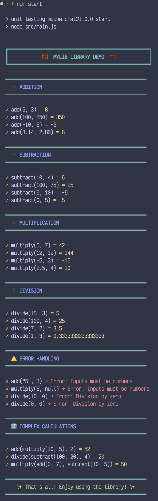
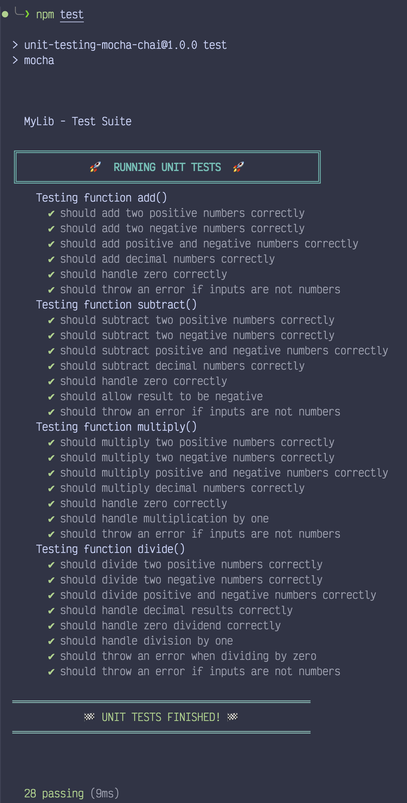

Unit testing example in JavaScript using Mocha and Chai


# Usage

## Initialization

```npm init -y```

## Dependencies Installation

```npm install --save-dev mocha chai```

## Running Tests

```npm test```

## Running App 

```npm start```

# Project Structure

```
unit-testing-mocha-chai
│
│
├── lib
│   ├── mylib.js         (Library module simple math functions)
│   └── myprintlib.js    (Library modules for printing messages to console)
├── screenshots          (Screenshots of the output)
│   ├── main-output.png
│   └── test-output.png
├── src
│   └── main.js          (Main application show usage of the libraries)
├── test
│   └── mylib.test.js    (Unit tests written using Mocha and Chai)
├── .gitignore
├── LICENSE
├── package-lock.json
├── package.json
└── README.md
```

# Description
This project demonstrates how to set up unit testing in JavaScript using Mocha as the test framework and Chai for assertions. It includes a simple library with functions and corresponding tests to validate their functionality.

# Example Output




